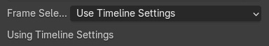
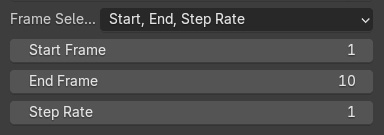
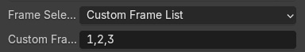

# Cuttlefish
Translating animated geometry from Blender to Grasshopper. Born out of the need to convert animations and motion capture into manufacturable analog artifacts.


<p><small>Push animated mesh data from Blender to Grasshopper</small></p>


<p><small>Animation Blender - Rhino/GH</small></p>

<br>

## Data Structure - Default Cube Example

Data gets saved as .npy to the directory specified in the UI.

### Vertices - XYZ Coordinates
```json
[
    [
        [0.0, 0.0, 0.0],
        [1.0, 0.0, 0.0],
        [1.0, 1.0, 0.0],
        [0.0, 1.0, 0.0],
        [0.0, 0.0, 1.0],
        [1.0, 0.0, 1.0],
        [1.0, 1.0, 1.0],
        [0.0, 1.0, 1.0]
    ],
    [
        [0.1, 0.0, 0.0],
        [1.1, 0.0, 0.0],
        [1.1, 1.0, 0.0],
        [0.1, 1.0, 0.0],
        [0.1, 0.0, 1.0],
        [1.1, 0.0, 1.0],
        [1.1, 1.0, 1.0],
        [0.1, 1.0, 1.0]
    ]
]
```

### Faces - Vertex Indices per Face
```json
[
    [0, 1, 2, 3],
    [4, 5, 6, 7],
    [0, 1, 5, 4],
    [1, 2, 6, 5],
    [2, 3, 7, 6],
    [3, 0, 4, 7]
]
```

### Edges - Indices Connected
Mesh reconstruction only uses Vertex and Face Data. Edge Data is optional and can be used for later calculations.
```json
[
    [0, 1],
    [1, 2],
    [2, 3],
    [3, 0],
    [4, 5],
    [5, 6],
    [6, 7],
    [7, 4],
    [0, 4],
    [1, 5],
    [2, 6],
    [3, 7]
]
``` 
<br>

## Selection Methods - Frame Sequence

<div style="display: flex; justify-content: space-between;">
  <div style="text-align: center; margin-right: 10px;">
    
    <p style="text-align: left;">Uses Timeline settings. They can be accessed in Blenders timeline-panel on the top right corner. Set the start/end values.</p>
  </div>
  <div style="text-align: center; margin-right: 10px;">
    
    <p style="text-align: left;">Set start/end/step values independent of Blenders timeline settings</p>
  </div>
  <div style="text-align: center;">
    
    <p style="text-align: left;">Input your custom list of frame indices. Step rate is irrelevant and doesn't need to be consistent within the list - choose indices freely.</p>
  </div>
</div>