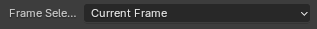
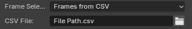

# Cuttlefish
Translating animated geometry from Blender to Grasshopper. Born out of the need to convert animations and motion capture into manufacturable analog artifacts.

<small>Push animated mesh data from Blender to Grasshopper</small>

<small>Animation Blender - Rhino/GH</small>

## Selection Methods - Frame Sequence

<table>
  <tr>
    <td style="text-align: left;">
      
      
Uses Start/End Timeline settings. They can be accessed in Blender's timeline panel on the top right corner.

    </td>
  </tr>
  <tr>
    <td style="text-align: left;">
      
      
Uses current frame from Blender's timeline settings.

    </td>
  </tr>
  <tr>
    <td style="text-align: left;">
      
      
Set start/end/step values independent of Blender's timeline settings.

    </td>
  </tr>
  <tr>
    <td style="text-align: left;">
      
      
Input your custom list of frame indices. Step rate is irrelevant and doesn't need to be consistent within the list - choose indices freely.

    </td>
  </tr>
  <tr>
    <td style="text-align: left;">
      
      
Import Ints from CSV File as List

    </td>
  </tr>
</table>